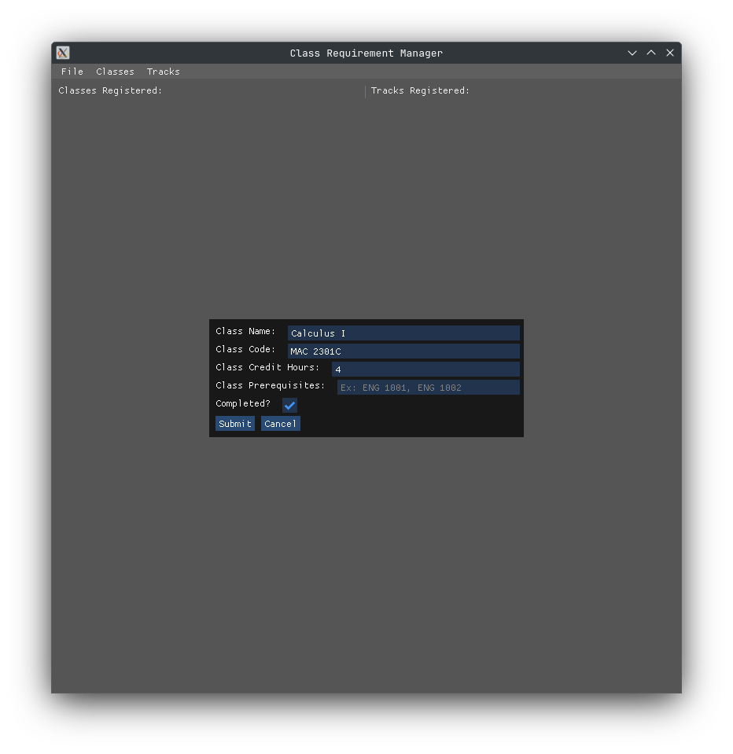
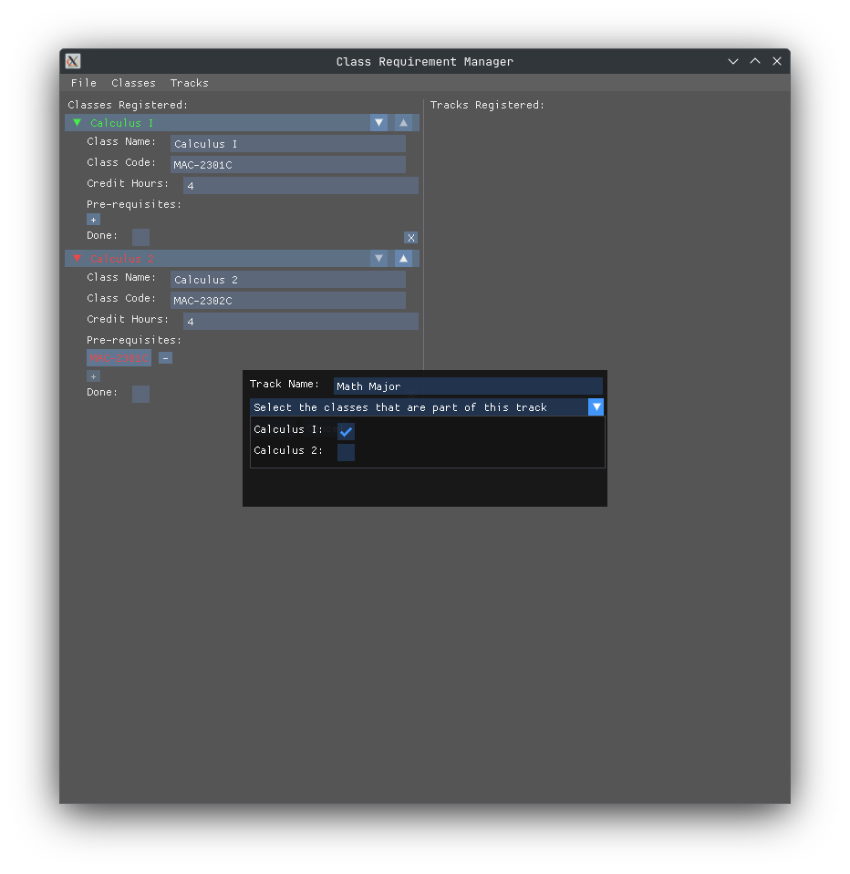
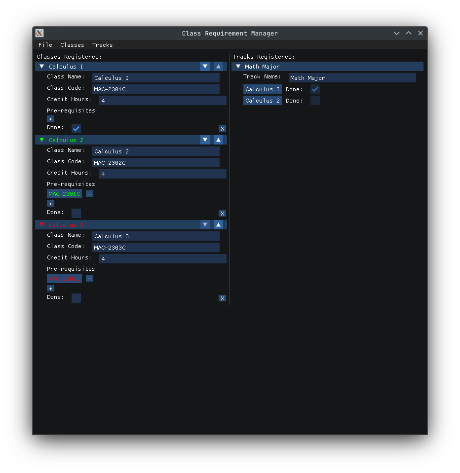

# Class Requirement Manager

This is a small project I've been using to learn C# and Dear ImGui at the same time. It manages classes for my college majors, and lets me sort through them in an efficient manner. It also looks pretty, but that's a work in progress and I will eventually make it look even cleaner.

I plan on adding the ability to assign classes to different majors/tracks and sort them by different things, and I want to add varying requirements and pre-requisites for different majors and classes respectively.

The app is also hopefully entirely cross platform, and the repository comes with the cimgui binaries for Windows, Mac, and Linux. It also comes with the shaders necessary for a variety of backends, from OpenGL to OpenGL ES to Vulkan to DX11 to Metal.

# Instructions
To run the app, just run
```sh
dotnet run
```

# Screenshots


